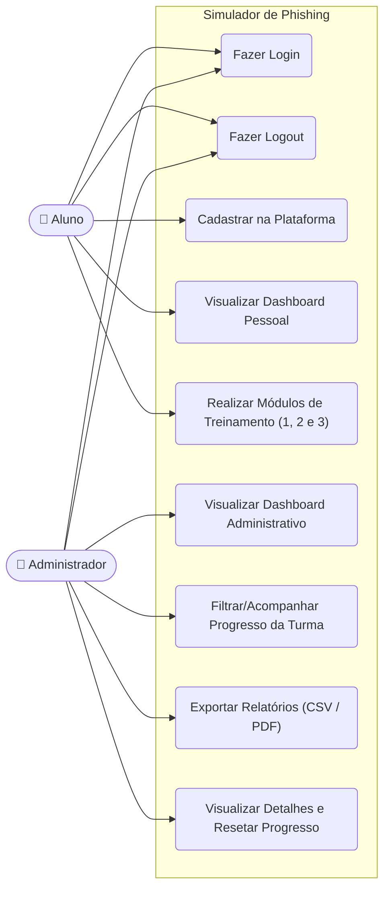

# Diagrama de Casos de Uso (UML)

Este diagrama representa as interações dos dois atores principais da aplicação (Aluno e Administrador) com as funcionalidades disponibilizadas pelo sistema Simulador de Phishing.

### Atores
- **Aluno**: Usuário regular focado em realizar os módulos de prevenção contra ataques.
- **Administrador**: Usuário com privilégios (`is_staff` / `is_superuser`), focado na extração de métricas de engajamento e risco da empresa.
