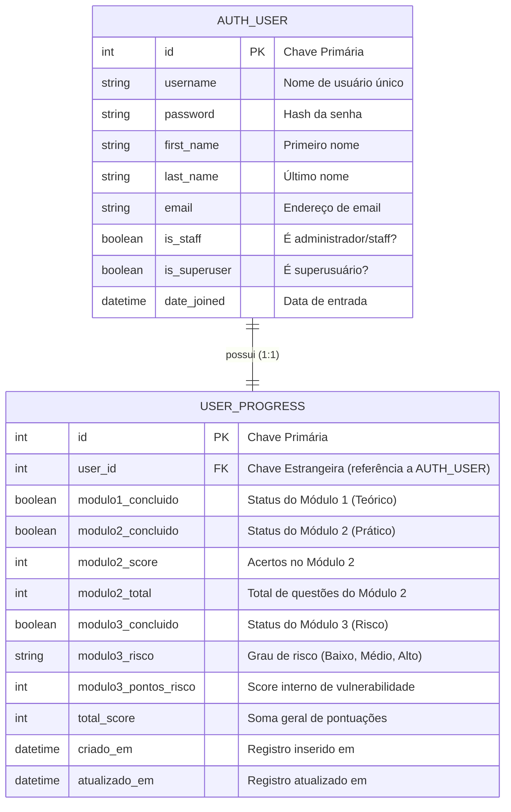

# Diagrama de Entidade e Relacionamento (DER)

Este diagrama modela a estrutura principal do banco de dados relacional. 
A arquitetura de dados neste simulador foca na extensão da tabela nativa de `User` do Django, agregando a ela as propriedades da tabela `UserProgress` através de um relacionamento **Um-para-Um (One-to-One)**.

### Explicação do Relacionamento
- Cada usuário (`AUTH_USER`) cadastrado na plataforma possui **apenas um** registro correspondente em `USER_PROGRESS`.
- O Django gerencia essa associação em nível de banco criando uma constraint de `UNIQUE` na chave estrangeira (`user_id`).
- Caso o usuário venha a ser deletado, o comportamento `on_delete=models.CASCADE` configurado no código deleta automaticamente o registro em `USER_PROGRESS`, mantendo a integridade referencial.
